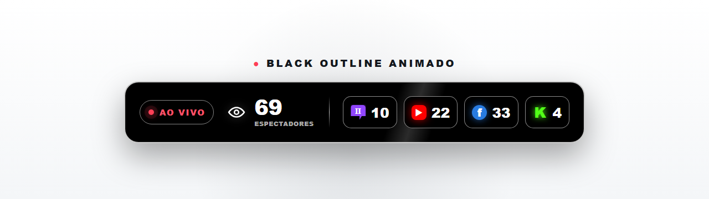

# Contador de Espectadores Guia Preto Animado Multistream

Widget visual para exibir, em uma única barra, o total de espectadores e a audiência individual das plataformas conectadas ao Streamlabs.

Esta é a edição preta animada do contador: fundo preto sólido, contornos brancos e movimentos suaves que valorizam a entrada do widget, as plataformas, o indicador **AO VIVO** e as mudanças na audiência.

## Prévia e tutorial

▶️ **[Assista ao tutorial completo no YouTube](https://youtu.be/rku8mhmT6jo)**

> **AVISO DE DIREITOS AUTORAIS E LICENÇA**  
> Este repositório é público para facilitar o acesso ao widget, mas o código **não está em domínio público** e **não possui licença para redistribuição**. O uso é gratuito somente nas condições descritas neste documento e no arquivo `LICENSE.txt`.

## Recursos

- Total automático de espectadores somando as plataformas exibidas.
- Contadores individuais para Twitch, YouTube, Facebook e Kick.
- Compatível com o widget **Contador de espectadores** do Streamlabs.
- Layout horizontal preto com contornos e divisórias brancas.
- Fundo externo transparente para integração com a cena.
- Entrada suave do widget ao ser carregado.
- Entrada escalonada dos cartões das plataformas.
- Indicador **AO VIVO** com pulsação contínua.
- Reflexo de luz atravessando periodicamente a barra.
- Reação visual e transição numérica quando o total de espectadores muda.
- Suporte à preferência de redução de movimento do sistema.
- Formatação numérica adaptada ao português do Brasil.
- Compatível com fontes de navegador do OBS Studio.

## Comportamento das animações

- A barra surge suavemente quando a fonte de navegador é carregada ou atualizada.
- Os cartões das plataformas entram em sequência.
- O ponto do indicador **AO VIVO** permanece pulsando.
- Um reflexo discreto atravessa o fundo aproximadamente a cada sete segundos.
- A alteração da audiência atualiza o total com uma transição suave.
- Em sistemas configurados para reduzir movimento, as animações CSS são desativadas automaticamente.

Esta edição não utiliza as ondas coloridas do modelo Cyber Waves e não corresponde ao modelo vertical.

## Requisitos

- Uma conta no Streamlabs.
- As plataformas desejadas conectadas e autorizadas no Streamlabs.
- O widget **Contador de espectadores** com HTML/CSS personalizado habilitado.
- Uma fonte de navegador no OBS Studio ou em outro programa compatível.

> A leitura dos espectadores depende dos dados entregues pelo Streamlabs e pelas plataformas conectadas. Uma plataforma offline, desconectada ou com atualização atrasada pode exibir zero temporariamente.

## Instalação

1. Abra o painel do Streamlabs.
2. Entre em **Todos os widgets** e abra **Contador de espectadores**.
3. Ative **HTML/CSS personalizado**.
4. Substitua o conteúdo da aba **HTML** pelo conteúdo do arquivo HTML deste projeto.
5. Substitua o conteúdo da aba **CSS** pelo conteúdo do arquivo CSS deste projeto.
6. Substitua o conteúdo da aba **JS** pelo conteúdo do arquivo JavaScript deste projeto.
7. Marque as plataformas que deseja mostrar.
8. Defina a cor de fundo do widget como transparente.
9. Salve as configurações.
10. No OBS Studio, atualize a fonte de navegador do widget.

## Arquivos

- **HTML:** estrutura do contador e modelo usado pelo Streamlabs para criar cada plataforma.
- **CSS:** visual preto, contornos, responsividade e animações do widget.
- **JS:** leitura, soma e transição do total de espectadores.
- **LICENSE.txt:** condições completas para utilização do projeto.

## Licença de uso

Copyright © 2026 Leonardo — Guia do Streamer. Todos os direitos reservados.

### Você pode

- Usar gratuitamente o widget em suas próprias transmissões pessoais ou monetizadas.
- Personalizar cores, tamanhos, textos, movimentos e aparência para uso próprio.
- Modificar o código para adequá-lo à sua própria transmissão.
- Exibir o widget em vídeos, lives, gravações e materiais que mostrem a sua transmissão.

### Você não pode

- Redistribuir, republicar ou disponibilizar o código original ou modificado, integralmente ou em partes substanciais.
- Criar repositórios espelho, páginas de download, pacotes, coleções ou arquivos alternativos contendo este projeto.
- Fazer reupload dos arquivos em sites, grupos, fóruns, redes sociais, vídeos ou outras plataformas.
- Vender, sublicenciar, alugar ou incluir este código em produtos, serviços, packs ou templates pagos ou gratuitos.
- Oferecer versões derivadas do widget para download ou distribuição.
- Remover ou alterar os avisos de autoria, licença ou identificação existentes nos arquivos.
- Apresentar o projeto, o layout, as animações ou o código como criação própria.
- Usar o nome **Guia do Streamer** de forma que sugira parceria, autorização ou endosso inexistente.

### Como compartilhar corretamente

Compartilhe somente o link da publicação ou do repositório oficial do **Guia do Streamer**. Não envie cópias dos arquivos e não crie links alternativos de download.

O acesso público ao repositório não concede permissão para revenda, redistribuição, reupload ou mudança de autoria. Qualquer uso que não esteja expressamente autorizado exige permissão prévia e escrita do responsável pelo projeto.

## Autoria e identificação

- **Projeto:** Contador de Espectadores Guia Preto Animado Multistream
- **Edição:** Black Outline Animado horizontal
- **Versão inicial:** 1.0.0
- **Identificador do projeto:** `GDS-VC-PRETO-ANIM-260908-917364`
- **Direção criativa, conceito, personalização, testes e publicação:** Leonardo — Guia do Streamer
- **Desenvolvimento técnico:** realizado com auxílio de Inteligência Artificial

Os arquivos HTML, CSS e JavaScript possuem avisos próprios de autoria, licença e identificação. O histórico de commits, as tags, as releases, os arquivos originais e as datas deste repositório fazem parte do registro técnico de evolução do projeto.

## Limites da proteção

Estas regras protegem o código, os textos, a documentação, a combinação visual e as animações específicas deste projeto. Elas não reivindicam exclusividade sobre a ideia genérica de um contador de espectadores, sobre recursos oferecidos pelo Streamlabs nem sobre implementações independentes que não copiem este material.

## Aviso de funcionamento

O widget é fornecido no estado em que se encontra, sem garantia de disponibilidade contínua. Mudanças realizadas pelo Streamlabs, pelas plataformas de transmissão ou pelo navegador integrado do OBS podem exigir atualizações futuras.

Streamlabs, Twitch, YouTube, Facebook, Kick e OBS são nomes e marcas pertencentes aos seus respectivos titulares. Este projeto é independente e não representa parceria ou endosso oficial dessas empresas.

## Créditos

Projeto criado para a comunidade do **Guia do Streamer**.

Se este widget ajudou sua transmissão, compartilhe o link oficial do projeto e preserve os créditos.
